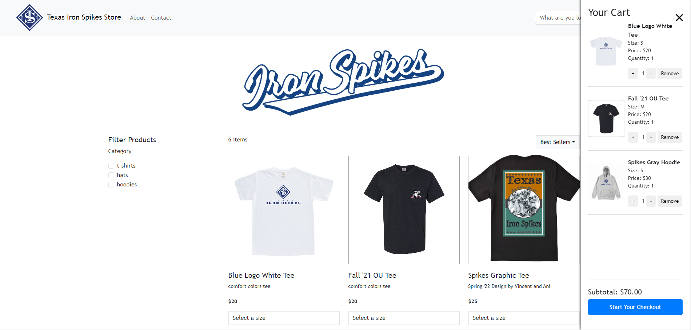

# [Texas Iron Spikes Merchandise Store](https://txmerchstore.web.app)

This project is a e-commerce store for the Texas Iron Spikes organization. Users can browse products, select sizes, and add them to a shopping cart, and checkout items. Internal use has been designed to allow easy inventory and order management.

## Tech Stack

- **Frontend:** React, React Bootstrap, Styled-Components
- **Backend:** Node.js, Express.js
- **Database:** Google Sheets API
- **Hosting:** Firebase Hosting and Firebase Functions

## Project Structure

- `frontend/`: Contains the React application for the user interface.
- `backend/`: Contains the Node.js/Express.js server that interfaces with the Google Sheets API to serve product data.
- `keys/`: (Note: This directory is not checked into version control for security reasons) Contains the service account key for the Google Sheets API.

## Local Development

Before starting, make sure you have [Node.js](https://nodejs.org/) installed on your system.

### Setting Up the Backend

1. Navigate to the `backend/` directory.
2. Install the dependencies with `npm install`.
3. Start the server with `npm start`.

### Setting Up the Frontend

1. Navigate to the `frontend/` directory.
2. Install the dependencies with `npm install`.
3. Start the React development server with `npm start`.

## Configuration

To configure the application for your use:

1. Update the `.env` file in the `backend/` directory with your Google Sheets API credentials.
2. Adjust the product data in your Google Sheets to match the format expected by the application.

## Contributing

We welcome contributions to the Texas Iron Spikes Merchandise Store. Please read our contribution guidelines before submitting a pull request.

---

© 2024 Texas Iron Spikes Organization
